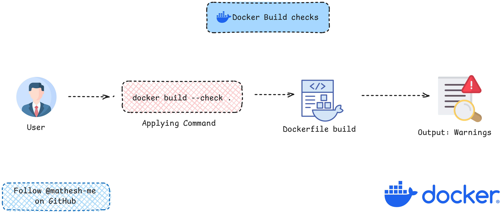

## Docker Build Checks: A Simple Linter for Dockerfiles

***Docker Build Checks are used to check your Dockerfile build configurations for issues, build options, and best practices.*** It is kind of advanced Linter that you can use to check your Dockerfile for any issues and warnings before you build your Docker image. It's just like running a dry-run of your Dockerfile to check if there are any issues or warnings before you build your Docker image.<br>

You can check the list of checks that Docker Build Checks can perform by clicking [here](https://docs.docker.com/reference/build-checks/)

### Working Diagram



### Prerequisites for Using Docker Build Checks

`Docker build check` is a feature introduced in `Dockerfile 1.8`. To run Docker Build Checks, you need to have `Docker Buildx` version `0.15.0` and later installed on your system. You can check the version of Docker Buildx installed on your system by running the following command:

```bash
docker buildx version
```

If you don't have Docker Buildx installed on your system, you can install it by running the following command:

- For Debian/Ubuntu based systems:

```bash
apt install docker-buildx-plugin
docker buildx install
```

- For Fedora/CentOS based systems:

```bash
yum install docker-buildx-plugin
docker buildx install
```

- If you have Docker Desktop installed on your system, Just update Docker Desktop to the latest version.<br>

### How to Run Docker Build Checks

Once you have Docker Buildx installed on your system, you can run Docker Build Checks by running the following commands:

- If you want the build to be successful irrespective of any Warnings or Errors:

```bash
docker build ./Dockerfile_location
```

- If you just want to see the warnings and errors without building the image:

```bash
docker build --check ./Dockerfile_location
```

- To fail a build if there are any warnings, You need to add the `check=error=true` to the Dockerfile:

```Dockerfile
# syntax=docker/dockerfile:1
# check=error=true

FROM node:16-alpine As base
WORKDIR /app
```
Now running `docker build ./Dockerfile_location` will fail if there are any warnings in the Dockerfile.<br>

### With GitHub Actions

You can also run Docker Build Checks in your GitHub Actions workflow to check your Dockerfile for any issues and warnings before you build your Docker image. 

#### Prerequisites

You should use the following versions of Docker Build and Push Action and Docker Bake Action in your GitHub Actions workflow to run Docker Build Checks:

```
docker/build-push-action version 6.6.0 and later
docker/bake-action version 5.6.0 and later
```

#### Example of using Docker Build Checks in GitHub Actions

```yaml
name: Build and push Docker images
on:
  push:

jobs:
  build:
    runs-on: ubuntu-latest
    steps:
      - name: Build and push
        uses: docker/build-push-action@v6.6.0
```

### References

- [Docker Build Checks](https://docs.docker.com/build/checks/)
- [Docker Buildx](https://docs.docker.com/buildx/working-with-buildx/)

This is just a simple guide to get you started with Docker Build Checks. You can explore more about Docker Build Checks by visiting the official Docker documentation links provided above. For hands-on experience, If you want to try running Docker Build Checks, You can try running Docker Build Checks on the `Dockerfile` I have provided in this repository.